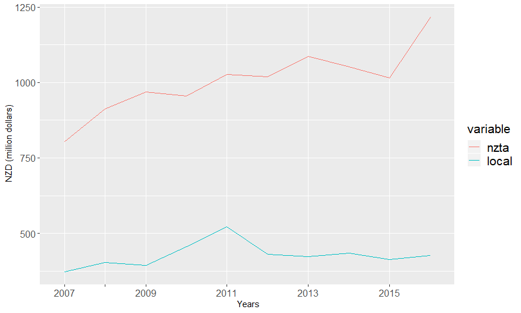
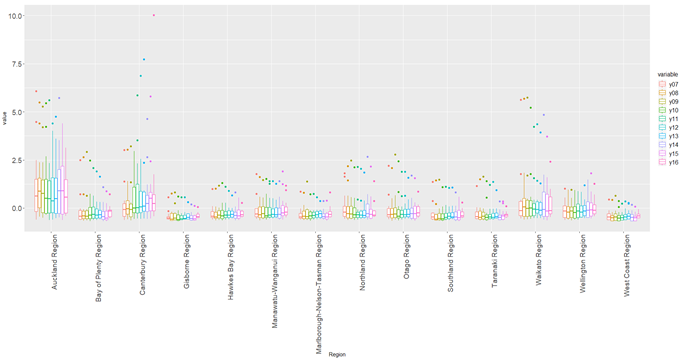

# NZCitiesAnalysis
Research on the relationship between public transport services and infrastructure expenditures of urban development in New Zealand.

## Datasets Description
This dataset was created by New Zealand government and stored at data.govt.nz in October 2016, and it contains the last ten years of transport-related expenditure on Maintenance, Operations, and Renewals funded by the Transport Agency (NZTA share) and Approved Organisations (local share). The dataset has 13 attributes and over fourteen thousand behaviours, and there are over 80 districts, so the amount of information is significant. The first column is region, which contains the cities and districts information. The second column is expenditure groups, which includes 6 items, Corridor, Emergency Reinstatement, Environment and Drainage, Network and Property Management, Pavement and Seal, Structures. The third column is Funding Authority, which mainly separated by NZTA and local share. The rest of the columns are the yearly records.

```Rstudio
# Download the dataset from data.gov.nz with excel format then import sheet - Breakdown
target = "http://www.nzta.govt.nz/assets/userfiles/transport-data/FundRoadMOR.xls"
dest = 'FundRoadMOR.xls'
download.file(url = target, destfile = dest, mode='wb')
dataset <- read_excel("FundRoadMOR.xls", sheet = "Breakdown")

# Briefly Check the dataset
str(dataset)
head(dataset)
tail(dataset)
```


## Identify duplicated datasets
Below analysis can prove this assumption which divides the dataset into three groups with “NZ”, “Region” and others, the sum of the total value proves that some data were duplicated, probably was used in previous statistical analysis. 
```Rstudio
#  grouping the dataset and confirm ation
dataset.nz <-subset(dataset, dataset$Region == "NZ")
dataset.region <- dataset[grep('Region',dataset$Region),]
dataset.others <- dataset[!grepl('Region',dataset$Region),]
dataset.others <- dataset.others[!grepl('NZ',dataset.others$Region),]
dataset.city <- dataset[grep('City',dataset$Region),]

# To confirm the information are correct, all different groups has the same total value.
colSums(dataset.nz[4:13],na.rm=T)
colSums(dataset.region[4:13],na.rm=T)
colSums(dataset.others[4:13],na.rm=T)
```


## Initial discovery - Univariate analysis
1. Expenditure difference between NZTA (red) and Local share (blue)
```Rstudio
ggplot(data=dataset.na.fa.long,
       aes(x=yrs, y=value, colour=variable)) +
  geom_line() + xlab("Years") + ylab(" NZD (million dollars)") +
  theme(axis.text.x = element_text(size = 12, face = "plain"),
        axis.text.y = element_text(size = 12, face = "plain"),
        legend.title=element_text(size=16), 
        legend.text=element_text(size=16)) +
  scale_x_discrete(name =" Years", limits=c("2007","","2009","","2011","", "2013","", "2015","", ""))
  ```
  
  
 Ans: Indicate that the government's long-term growth in public expenditure is almost one hundred miles per year, which is quite impressive. The local share did not pay enough, and all walks of life may need more participation to strengthen regional construction. 

2. Identify the expenditure distribution.
```Rstudio
ggplot(datasetn.region, aes(x = EG, y = y16, fill = Region)) +
  geom_bar(stat="identity") + theme(legend.position="bottom",legend.text=element_text(size=10)) + 
  ggtitle("Area distribution in Expenditure Group 2016/17") +
  theme(axis.text.x = element_text(size = 16, face = "plain"),
        axis.text.y = element_text(size = 16, face = "plain"),
        legend.title=element_text(size=12), 
        legend.text=element_text(size=12)) 
```

 
Ans: The large amount is pavement and seal, and this can explain the traffic construction has a close relationship with urban development and the economy. On the other hand, the emergency reinstatement of Canterbury region is significantly large, and the information of this reinstatement is limited and requires further research on it.

```Rstudio

ggplot() + geom_sf(data = nzmap, aes(fill = Expenditure)) +
  geom_sf(data = nz_height) +
  scale_x_continuous(breaks = c(170, 175)) + 
   ggtitle(" 2016/17 Region distrubtion ")
```
 
Ans: The aesthetics geographic map method, which can visualize the area to describe those regions where spending is the highest clearly. Obviously, the Auckland region is lighter blue, indicating high expenditures. The Canterbury region in the South Island is shallower, which may be related to the special emergency reinstatement. However, the overall expenditure is huge, and this can assume that its economic growth is also prominent, which far more than the Waikato Region and the Wellington Region.

```Rstudio
# prepare the Treemap to show the main city information
city.value <- data.frame(id = integer(0), yrs = numeric(0))
# Calculate the Expenditure in different region at 2016/17
for (i in 1:80) {
  city.value <- rbind(city.value,data.frame(id = levels(city.levels)[i], yrs = colSums(subset(datasetn.others, datasetn.others$Region == levels(city.levels)[i])[,13])))
}
ggplot(city.value, ggplot2::aes(area = yrs, fill = id, label = id)) +
  geom_treemap() + theme(legend.position="") +
  geom_treemap_text(colour = "white", place = "topleft", reflow = T)
```
 
 Ans: A further analysis of expenditure breakdowns in major cities and major regions of New Zealand. Since more than 80 areas are involved, the general scatter plot and pie chart cannot indicate clearly so that treemap can be the best option. The larger the area is proportional to the bigger value, and important information has retained, the observation and analysis are particularly obvious. It can be found that some road construction in Canterbury and Christchurch are much greater than Auckland City, which can effectively support and strengthen the assumptions of rapid economic growth.
 
 
 ## The second step - Bivariate analysis
The total expenditure groups boxplot, this can easier to explain the description of sustainable development, again the Canterbury region is less than Auckland region. However, it is increasing in the past years, the others region are likely kept with the similar level which means no special economic development activities. 

```Rstudio
# Region distrubtion from 2007 ~ 2017
datasetn.region.m.region.yrs <- melt(datasetn.region.m, id.vars='Region', measure.vars= c('y07','y08','y09', 'y10', 'y11', 'y12', 'y13', 'y14', 'y15', 'y16'))
ggplot(datasetn.region.m.region.yrs, aes(x = Region,y = value)) + 
  geom_boxplot(aes(x= Region, y= value, color=variable)) +
  theme(axis.text.x = element_text(size = 14, angle=90, hjust=1, face = "plain"),
        axis.text.y = element_text(size = 14, face = "plain"),
        legend.title=element_text(size=12), 
        legend.text=element_text(size=12))
```


On the other hand, there are two keys factors and closely related to economic, which are network and property management. It is because they directly reflect the people's livelihood and living environment are closely related. When the basic construction is completed, more people will choose to move, which will effectively promote economic development.

```Rstudio
# Network & Property Management in Expenditure Group from 2007 ~ 2017
datasetn.region.m.np <- subset(datasetn.region.m, datasetn.region.m$EG == EG.levles[4])
datasetn.region.m.np.box <- melt(datasetn.region.m.np, id.vars='Region', measure.vars= c('y07','y08','y09', 'y10', 'y11', 'y12', 'y13', 'y14', 'y15', 'y16'))
ggplot(datasetn.region.m.np.box) + geom_boxplot(aes(x= Region, y= value, color=variable)) +
  theme(axis.text.x = element_text(size = 14, angle=90, hjust=1, face = "plain"),
        axis.text.y = element_text(size = 14, face = "plain"),
        legend.title=element_text(size=12), 
        legend.text=element_text(size=12))

city.levels <- factor(datasetn.others$Region)
```


## Simple predict the expenditure expands in coming years
Below figure is a linear regression model to predict the expenditure expands. It is essential to forecast this information because of the economic construction is based on the government's development policy, and these expenditures are closely related to taxation, which can effectively control the fiscal budget to have a positive impact on the entire country. The black dots were the past years' expenditure, and the red dots are the prediction, although it is a linear model, there is a basic idea of the grow.


```Rstudio
# Total Expenditure per year
totexp <- as.data.frame(colSums(dataset.region[,4:13], na.rm = T))
colnames(totexp) <- "Expenditure"
totexp <- cbind(yrs = c(1:10),totexp)
tot.lm <- lm(Expenditure~.,totexp)
totexp <- cbind(totexp, predict = c("p","p","p","p","p","p","p","p","p","p"))
levels(totexp$predict) <- c("p","n")
totexp <- rbind(totexp, c(11, (tot.lm$fitted.values[10]+tot.lm$coefficients[2]), "n"))
totexp <- rbind(totexp, c(12, (tot.lm$fitted.values[10]+tot.lm$coefficients[2]*2), "n"))
plot(Expenditure ~yrs, totexp, main="Total Expenditure per year", col=totexp$predict, pch=0, xaxt="n")
axis(1, at = seq(1, 12, by = 1), labels = c("2007","","","","2011","","","","2015","","","2017"), font = 2)
abline(tot.lm,totexp)
```


